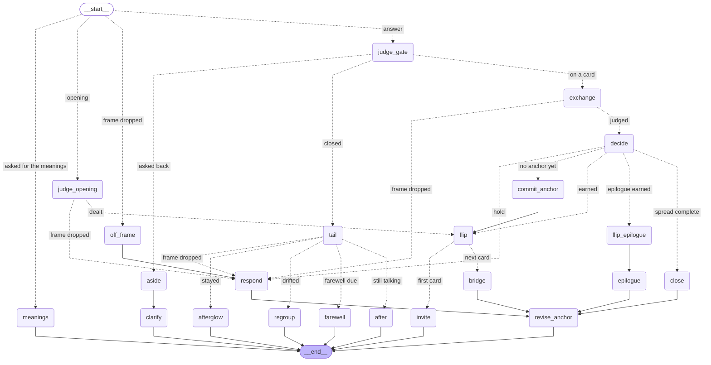

# AI Tarot Projection

For people who don't believe in tarot but believe in thinking out loud.

Three cards go face down on the table before anything is said. You are asked
what you see in the one in front of you — not what it means, what you see — and
it turns over when the conversation has somewhere to go. Nothing here predicts
anything. The deck is a projective surface: something specific and strange to
point at, so that the thing you actually wanted to say has an easier route out
than "I've been a bit off lately." The reader's job is to hand your own words
back to you in an order you hadn't tried.

The app runs entirely in your browser against an API key you supply. There is no
account, no server that remembers you, and nothing of yours at rest anywhere.

## Your key, and where it goes

The honest answer to "why should I trust this with my key" is that you shouldn't
have to trust it — you should be able to read it. So the whole path a key takes
is short enough to read in one sitting, and there are three of them to choose
from.

**Direct.** The browser talks to the provider. Nothing of ours is between you
and them; there is no relay to trust because there is no relay. This is the
maximally paranoid option and it only works with providers whose CORS policy
permits it.

**Your own relay.** You run [`server/relay.py`](server/relay.py) on your own
machine — about three hundred lines of Python, no dependencies outside the
standard library — and it serves the page and forwards one call per request.
This is the self-host path below.

**The hosted relay.** A [Cloudflare Worker](worker/src/index.js), under a
hundred and forty lines, for the case where you just want to open a URL on your
phone. Your key still comes from your browser, per request.

Both relays implement one contract, [RELAY.md](RELAY.md), and the frontend
cannot tell which one is answering — that indistinguishability is a design
rule, tested rather than asserted. The rules that matter are the same on both:
the key arrives in an `Authorization` header, is used inside the single request
that carried it, and then it is gone. It is never written to a session map, a
global, a file, or a database. It is never logged, redacted by header name *and*
by value, so a key that shows up inside an upstream error message gets scrubbed
before it reaches any output. It is never echoed back in an error response.
Neither relay knows what tarot is, holds any session state, or keeps any of your
conversation.

The two relays differ in exactly one way, deliberately. The Python one has a
`DEV_LOG=1` flag that logs full request and response bodies with auth material
redacted — a person logging their own conversations on their own machine is the
intended use, and it is off by default. The Worker has **no logging code path at
all**: not a disabled one, not a commented-out one, not a `console.log` behind a
flag. A hosted conversation is unloggable by construction, and a test greps the
Worker source to keep it that way.

You do not have to take any of that on faith. `scripts/run_contract_tests.sh`
runs the same suite against both relays, and among the twenty assertions are a
canary key that must appear in no captured output, and the same canary checked
against every error branch. It is one of the five legs of `scripts/test.sh`,
which is everything that can be checked without a key or a network — the engine
tests, the pack schema, a seeded session that has to reach its ending, and the
relay contract, and the graph — its README drawing and its recorded scenarios —
checked against the code. `scripts/test.sh --fast` skips the contract leg, which is the
slow one; the Worker half of it needs `wrangler` or `npx` on PATH and says so
loudly rather than passing one relay and reporting two.

## The engine is a graph

The reading is a state machine, and it is written as one: a
[LangGraph](https://github.com/langchain-ai/langgraphjs) `StateGraph` in
[`web/js/engine/graph.js`](web/js/engine/graph.js), running in your browser
where the engine has always run. One turn of the conversation is one run of
the graph. Every kind of turn the reader can take is a node with that name;
every decision — hold or flip, dwell, earn the fourth card, close, say
goodbye — is a conditional edge, and the label on it is the key its router
returned. The picture below is not maintained by hand. It is what the
compiled graph draws of itself, written here by
[`scripts/draw_graph.mjs`](scripts/draw_graph.mjs), and `scripts/test.sh`
fails if the code and the picture disagree. The live version, with a tooltip
on every node and seventeen recorded scenarios that light the path a turn
took, is at [`graph.html`](https://wyc79.github.io/ai-tarot-projection/graph.html)
— it runs nothing, needs no key, and works with the relay unreachable.

<!-- graph:begin -->

<!-- graph:end -->

Two honest notes about the dependency. LangGraph is here because "built on
LangGraph" is something this project wants to be able to say truthfully; it
did not make the engine simpler, and the plan says so. And it is vendored,
not fetched: `web/vendor/langgraph.js` is one pinned, minified ES module
built from the lockfile by
[`scripts/vendor_langgraph.sh`](scripts/vendor_langgraph.sh), whose
`--check` rebuilds it and byte-compares — the audit path for a 1.3 MB file
nobody reads. The same script vendors Mermaid for the graph page alone. No
page here loads a script from another origin, because a script on one page
of this origin could read the `tarot:` keys on every page.

The LangSmith tracer ships inside that bundle and is never enabled. Nothing
in the graph is configured to trace, there is no key for it to trace with,
and a test runs a whole seeded reading with `fetch` replaced by a function
that throws. A reading's words go to the model you chose and nowhere else,
and that is still tested rather than asserted.

## Bring your own deck

If you own a tarot deck, the app would rather you used it. Choose "my own deck"
before you start and the app deals four empty slots instead of cards: you
shuffle, lay four face down in a row, and turn one over yourself when the
reading reaches it. It then asks which card you turned, and you tell it. The
only thing that crosses the wire is the card's name — the app never sees your
deck, and the reading proceeds identically from there. It is the better version
of the idea, because the object on the table is genuinely yours and genuinely
random, and because the small ceremony of turning a card over by hand is most of
what the interface was imitating.

## Running it yourself

You need Python 3 (tested on 3.10) and nothing else. No build step, no package
install, no Node. (Re-vendoring the LangGraph and Mermaid bundles under
`web/vendor/` needs Node once; running the app never does.)

```
git clone https://github.com/wyc79/ai-tarot-projection.git
cd ai-tarot-projection
cp .env.example .env
python3 server/relay.py
```

Then open <http://localhost:8787> and paste your API key into the settings
panel. `.env.example` copies across as-is and needs no editing to get started —
there is deliberately no API key in it, because the key comes from your browser
per request and putting one in a file is the thing this design is avoiding. What
is in there is the port, the allowed origins, the dev-log switch, and an
optional provider map.

To check the relay is up before you spend a token on it:

```
curl http://localhost:8787/v1/health
{"ok": true, "providers": ["anthropic", "deepseek", "opencode", "opencode-go"]}
```

`http://localhost:8787/pack.html` browses every card in the deck and pings the
relay, and needs no key at all, so it is the cheapest way to confirm things
work. `debug.html` is the same session machinery with the gate, the anchor and
the assembled prompt on screen.

The relay serves the frontend from `web/` at the root with `data/` under
`/data/`, which is the same shape GitHub Pages gets below. That is why every
path in the frontend is relative and why the same files work in both places
untouched.

## Deploying your own

Two independent pieces: GitHub Pages serves the static site, and a Cloudflare
Worker relays the API calls. Neither knows about the other except through one
constant and one allow-list.

**The site.** [`.github/workflows/pages.yml`](.github/workflows/pages.yml)
publishes on every push to `main`. It composes a directory — `web/` at the root,
`data/` under `/data/` — and uploads that; nothing else in the repo is copied, so
`.env`, `checkpoint/` and `redactions/` cannot reach the published site even if
they existed in the checkout, which being gitignored they don't. Enable it under
**Settings → Pages → Build and deployment → Source: GitHub Actions**, once.

**The relay.** In the Cloudflare dashboard:

1. **Workers & Pages → Create → Workers → Connect to Git**, and pick this
   repository.
2. Name the Worker **`ai-tarot-relay`**. This is not cosmetic: the name must
   match `name` in [`worker/wrangler.toml`](worker/wrangler.toml) or the build
   fails.
3. **Git branch**: `main`.
4. **Root directory**: `worker`.
5. **Build command**: leave empty. There is no build step.
6. **Deploy command**: `npx wrangler deploy`, which is the default.
7. Save, then go to the Worker's **Settings → Build → Build watch paths** and
   set **Include paths** to `worker/*`, leaving **Exclude paths** empty. Paths
   are repo-root-relative and `*` matches zero or more characters. This is the
   line that keeps a pack edit from redeploying the relay: pushes touching only
   `web/` or `data/` will not trigger a build. Confirm it by pushing a
   `web/`-only change and watching no build start.

Then wire the two ends together, which is two edits that have to agree:

- `HOSTED_RELAY_BASE` in [`web/js/relayBase.js`](web/js/relayBase.js) — the
  Worker's URL, no trailing slash. For this repo that is
  `https://ai-tarot-relay.yuanchen-wang79.workers.dev`; a fork gets its own
  subdomain and puts that here instead. A page whose constant does not name a
  live Worker falls back to same-origin, where there is no relay, and every call
  fails.
- `ALLOWED_ORIGINS` in `worker/wrangler.toml` — the Pages origin, which for this
  repo is `https://wyc79.github.io`. Leaving it `*` would let anyone point their
  own page at your Worker.

A fork changes `PAGES_ORIGIN` in the same file to its own. For local Worker
development, `cp worker/.dev.vars.example worker/.dev.vars` puts `*` back for
`wrangler dev` only; that file is gitignored and never deployed.

## Forking the deck

A symbol pack is a self-contained directory, and `data/` is one. It holds
`deck.json` (the cards, the three positions, the earned fourth, and the
scaffolding levels), `persona.md` (how the reader talks), `few-shots.json` (what
good looks like), and `Cards-jpg/` (the images). All four are static files the
frontend fetches, which is the point: changing how the reader sounds is a file
save, and never a relay deploy.

Point the loader at another directory and nothing else changes. To build a new
pack, [`scripts/build_deck.py`](scripts/build_deck.py) maps a directory of card
images to stable ids and names and pre-fills the text fields as raw material —
it leaves the per-position meanings empty on purpose, so that the validator
fails until a person has written them. Then
[`scripts/validate_deck.py`](scripts/validate_deck.py) checks any pack directory
against the schema:

```
python3 scripts/validate_deck.py data
ok: data validates against pack schema v5 (0 warnings)
```

It runs against any pack, not just this one — "fork it, drop in your own deck"
only means anything if a fork can check itself.

## What this is not

This is a space for reflection, not therapy or crisis support. If things are
heavy right now, <https://findahelpline.com> lists people who can actually help.
The reader will step out of the tarot frame and say so plainly if a conversation
goes somewhere the cards have no business being.

## Licence

The code is MIT — see [LICENSE](LICENSE).

The 78 card images are scans of the Smith-Waite deck first published by William
Rider & Son in 1909 and illustrated by Pamela Colman Smith, which is in the
public domain in the United States and in life-plus-70 countries. The card back
is not a scan and is not old: it was drawn by [luciellaes][pack], who released it
under CC0. Both reach this repo through that one asset pack, [Rider-Waite Smith
Tarot Cards (CC0)][pack] — CC0 asks for no credit, and it is given here because
the work was worth the ask.

The deck is called "Smith-Waite (1909)" throughout rather than by the more
familiar name, because US Games Systems holds trademarks around that branding and
the public-domain status of the artwork is a separate question from the name used
to sell it. The imagery lines and per-position meanings in `deck.json` are
written for this project. Full provenance, including how the source was pinned
down and which claim rests on what, is in [LICENSE-ART.md](LICENSE-ART.md).

[pack]: https://luciellaes.itch.io/rider-waite-smith-tarot-cards-cc0
